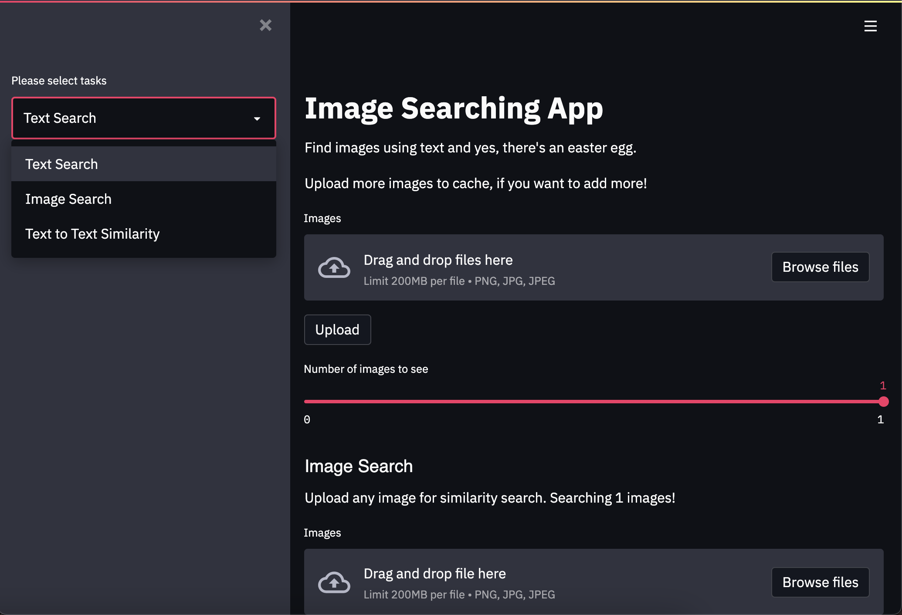

# NL-Images

NL-Images uses Cross-Modal-Search models to predict the similarity between given images and text. Find the different available models to perform this task in the following folders:
- [`clip/`](./clip/): CLIP (Contrastive Language-Image Pre-Training) is a neural network that consists of a image encoder and a text encoder. Given an image, it predicts the most relevant text and vice versa.

Files:
- `run.py`: streamlit webapp for simple ranking of text to images.
- `search_vis.py`: streamlit webapp for searching and similarity demo.

### Usage

Two commands and you are good to go:
```
# install packages
$ pip install -r requirements.txt

# run the interactive webapp
$ streamlit run run.py

  You can now view your Streamlit app in your browser.

  Local URL: http://localhost:8501
  Network URL: http://192.168.1.4:8501

100%|███████████████████████████████████████| 256M/256M [02:10<00:00, 1.96MiB/s]
100%|█████████████████████████████████████| 1.36M/1.36M [00:01<00:00, 1.31MiB/s]
Embeddings path not found, upload images to create embeddings
```

If everything goes correctly, it should automatically open up a browser with the network URL. On the left you will see the build apps, select the one that you want to use.




### Search in more than one way!

Perform `image-text`, `text-image`, `image-image`, (`text-text` as well, but it's not good) similarity.

